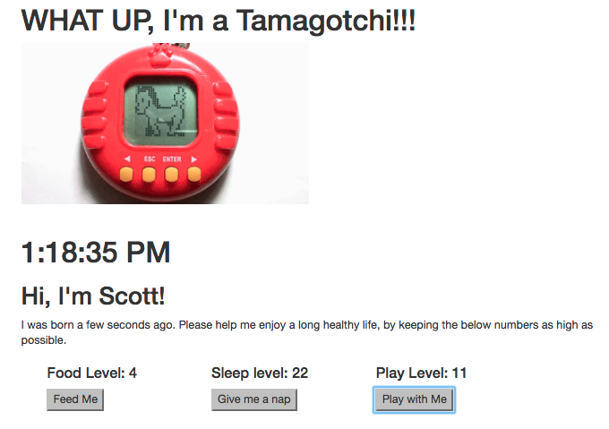
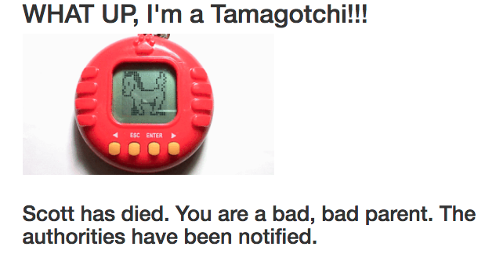

# Tamagotchi

#### _Epicodus Exercise: Create functional Tamagotchi app using ReactJS, September 14th, 2017_
**_By Calla Rudolph and Max Scher_**

## Description
This web application will allow a user to create new small digital friend, whose vital stats (food, sleep & play) they must monitor and treat in order to keep the young digital creature alive.

## Prerequisites
* [Node.js](https://nodejs.org/) (with NPM)

## Installation Instructions
* Open Terminal and type:
  * `$ cd Desktop`
  * `$ git clone https://github.com/CallaRudolph/react-tamagotchi`
  * `$ cd js-tamagotchi`
  * `$ npm install`
  * `$ atom .`

### Serving Program
* In Terminal, run `$ npm run start`
* In your Browser (Chrome preferred) navigate to [http://localhost:8080/](http://localhost:8080/)

## Technologies Used
* [Node.js](https://nodejs.org/) (with NPM).
* [ReactJS](https://facebook.github.io/react/)
* [Webpack](https://webpack.js.org/)
* [Babel](https://babeljs.io/)
* [MomentJS](https://momentjs.com/)

## Check Team Saucesome's GitHubs!
* [Max Scher](https://github.com/maxobaxo)
* [Calla Rudolph](https://github.com/CallaRudolph)

## License Information
This web application is free to use under the MIT License  
&copy; Calla Rudolph & Max Scher
